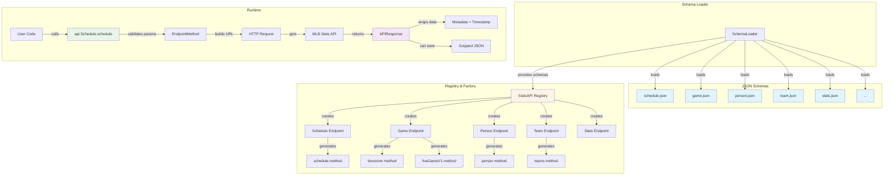
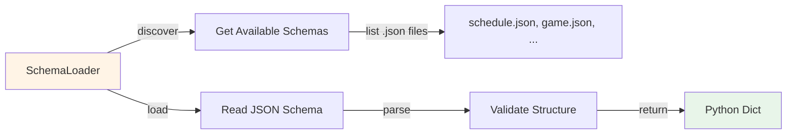
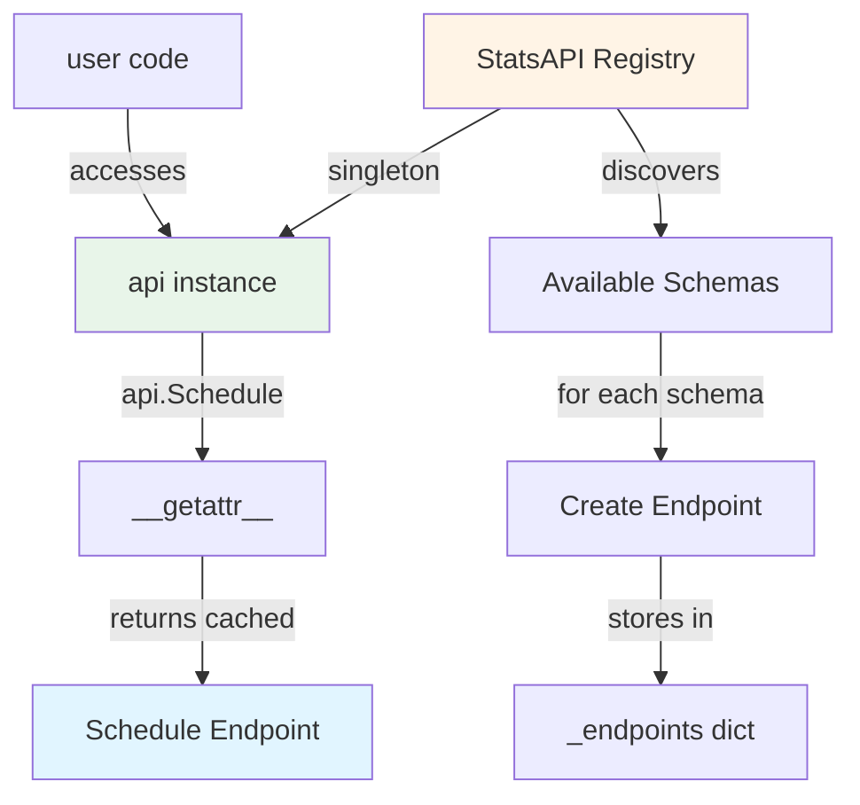
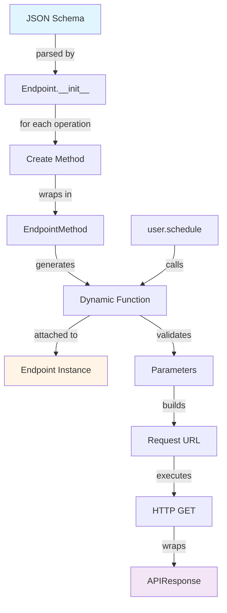
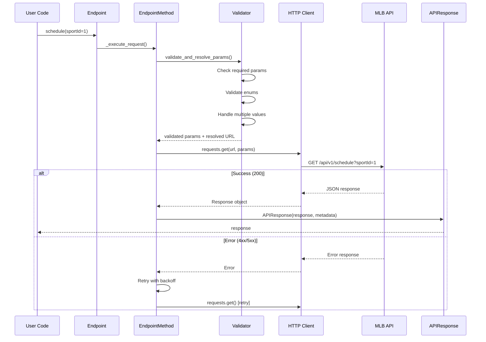
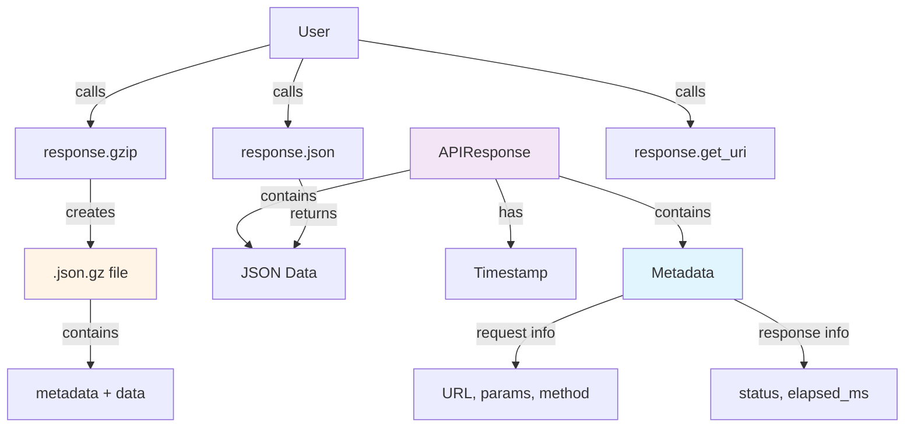
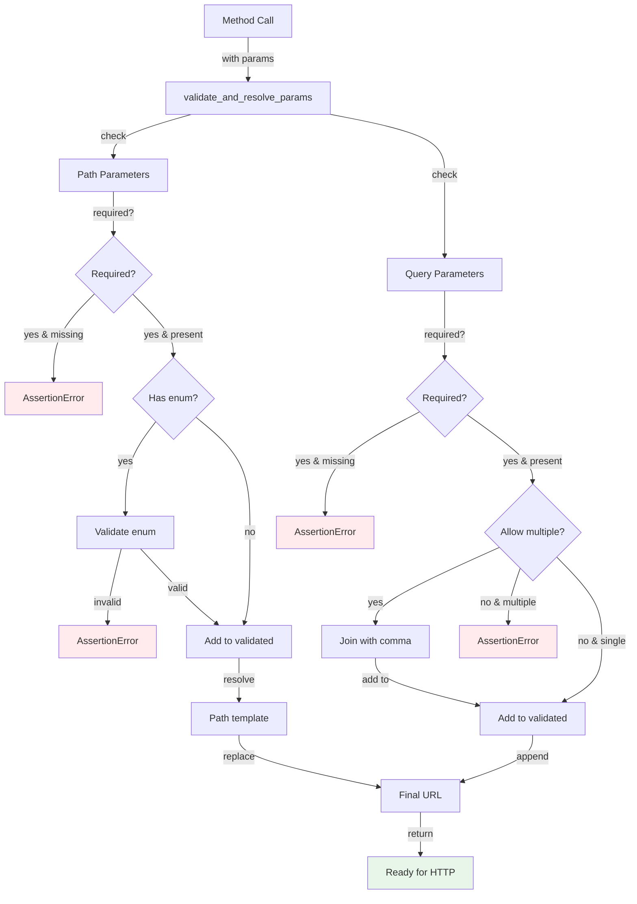
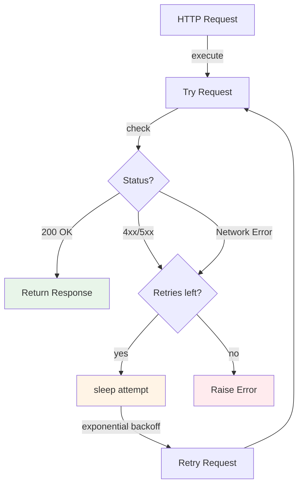

# PyMLB StatsAPI Architecture

## Schema-Driven Design



## Component Breakdown

### 1. Schema Layer (`pymlb_statsapi/resources/schemas/`)

```
schemas/
└── statsapi/
    └── stats_api_1_0/
        ├── schedule.json      # Schedule endpoints
        ├── game.json          # Game data endpoints
        ├── person.json        # Player/person endpoints
        ├── team.json          # Team endpoints
        ├── stats.json         # Statistics endpoints
        └── ...
```

**Schema Structure:**
```json
{
  "apiVersion": "1.0",
  "swaggerVersion": "1.2",
  "apis": [
    {
      "path": "/v1/schedule",
      "description": "schedule",
      "operations": [
        {
          "method": "GET",
          "nickname": "schedule",
          "summary": "View schedule info",
          "parameters": [
            {
              "name": "sportId",
              "paramType": "query",
              "type": "integer",
              "required": false
            }
          ]
        }
      ]
    }
  ]
}
```

### 2. Schema Loader (`pymlb_statsapi/utils/schema_loader.py`)



**Key Methods:**
- `get_available_schemas()` - List all schema files
- `load_stats_schema(name)` - Load a specific schema
- `load_endpoint_model(name)` - Load endpoint configuration

### 3. Registry & Factory (`pymlb_statsapi/model/`)

#### StatsAPI Registry



**Lazy Loading:**
- Endpoints created on first access
- Cached for subsequent calls
- Attribute access: `api.Schedule` → `Endpoint("schedule")`

#### Endpoint Factory



**Dynamic Method Generation:**
```python
# Schema operation becomes a callable method
operation = {
    "method": "GET",
    "nickname": "schedule",
    "parameters": [...]
}

# Generates:
endpoint.schedule(sportId=1, date="2024-10-27")
```

### 4. Request Execution Flow



### 5. Response Handling



**Storage Format:**
```json
{
  "metadata": {
    "request": {
      "endpoint_name": "schedule",
      "method_name": "schedule",
      "path_params": {},
      "query_params": {"sportId": "1"},
      "url": "https://statsapi.mlb.com/api/v1/schedule?sportId=1",
      "timestamp": "2025-01-15T10:30:00.123456+00:00"
    },
    "response": {
      "status_code": 200,
      "elapsed_ms": 245.3
    }
  },
  "data": {
    "dates": [...]
  }
}
```

### 6. Parameter Validation Flow



### 7. HTTP Retry Logic



**Retry Parameters:**
- `MAX_RETRIES` = 3
- Backoff: `sleep(attempt)` → 0s, 1s, 2s
- Retries on: 5xx errors, connection errors, timeouts
- No retry on: 4xx errors (but currently retries due to AssertionError)

## Data Flow Summary

```mermaid
graph LR
    A[JSON Schemas] -->|loaded by| B[SchemaLoader]
    B -->|provides to| C[StatsAPI Registry]
    C -->|creates| D[Endpoints]
    D -->|generates| E[Dynamic Methods]
    E -->|called by| F[User Code]
    F -->|validates| G[Parameters]
    G -->|builds| H[HTTP Request]
    H -->|calls| I[MLB API]
    I -->|returns| J[APIResponse]
    J -->|saves to| K[Gzipped JSON]

    style A fill:#e1f5ff
    style C fill:#fff4e6
    style E fill:#e8f5e9
    style J fill:#f3e5f5
    style K fill:#fff9c4
```



## Key Design Principles

1. **100% Schema-Driven**
   - No hardcoded endpoint classes
   - Everything generated from JSON schemas
   - Add new endpoints by adding schemas

2. **Zero Manual Maintenance**
   - Methods auto-generated at runtime
   - Parameter validation from schema
   - Documentation from schema metadata

3. **Type-Safe Without Types**
   - Runtime parameter validation
   - Enum checking
   - Required/optional enforcement

4. **Efficient Storage**
   - Gzip compression (80-95% reduction)
   - Metadata wrapping with timestamps
   - Reproducible data snapshots

5. **Robust Error Handling**
   - Automatic retry with backoff
   - Clear validation errors
   - Helpful error messages

6. **Developer Experience**
   - IDE autocomplete (via `__getattr__`)
   - Introspection methods (`.get_schema()`, `.list_parameters()`)
   - Helpful method docstrings generated from schemas
