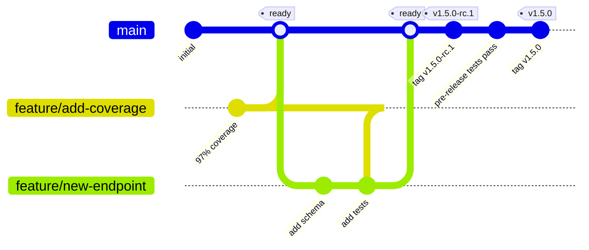
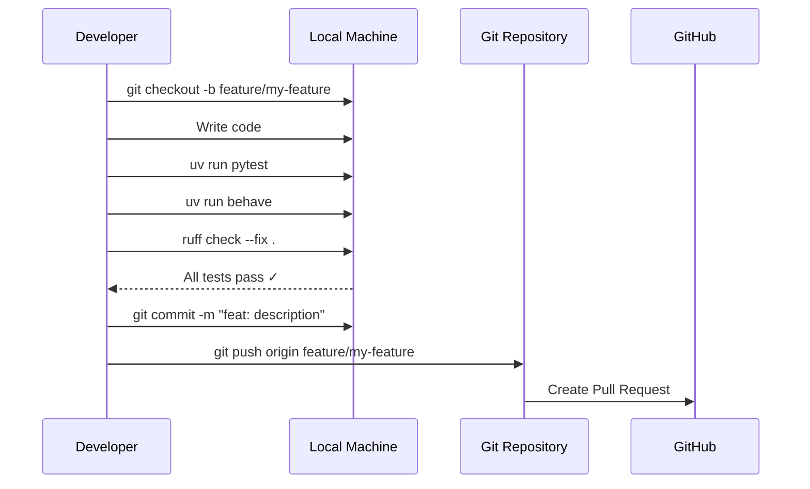
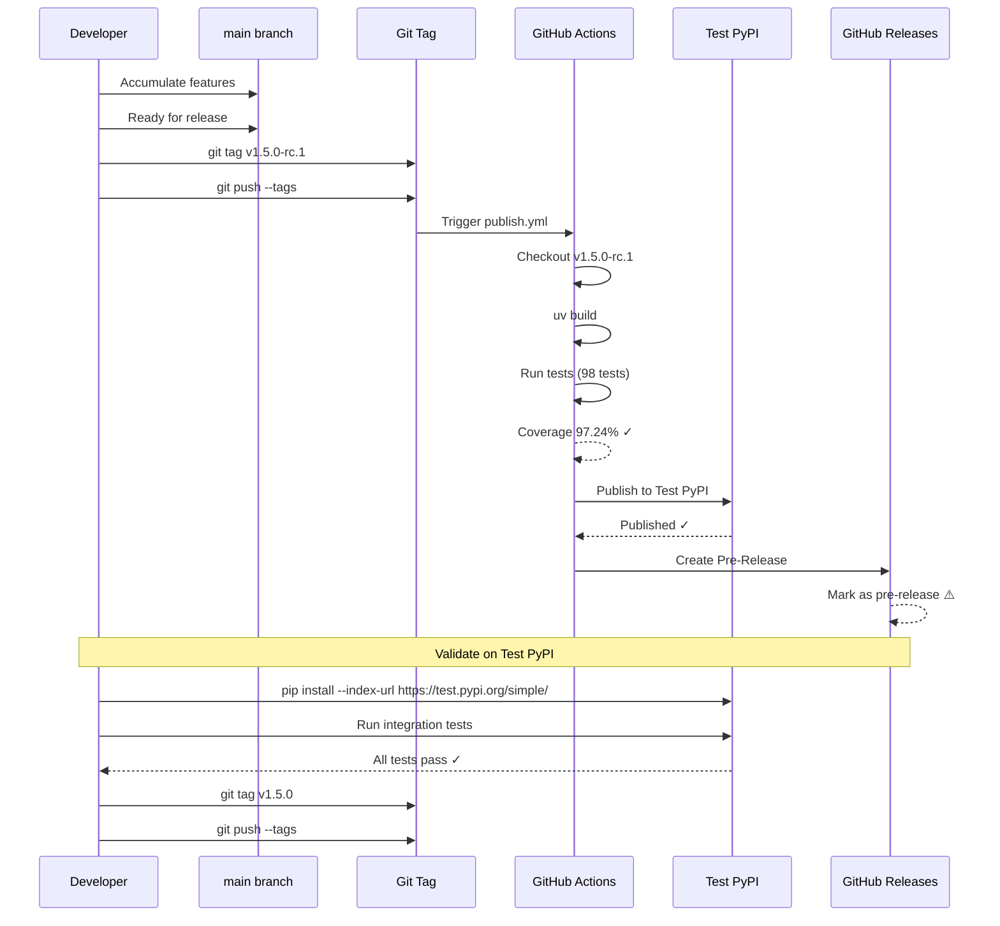
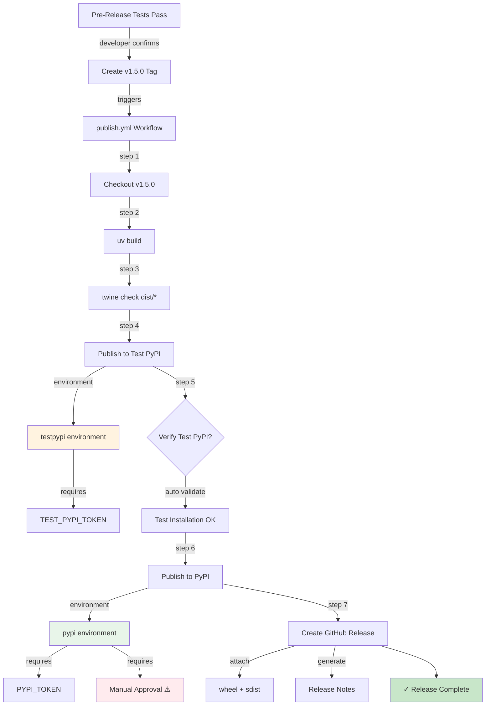
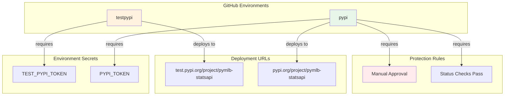
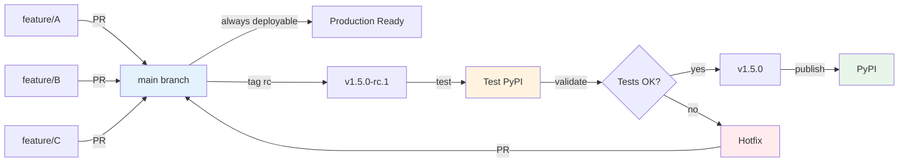
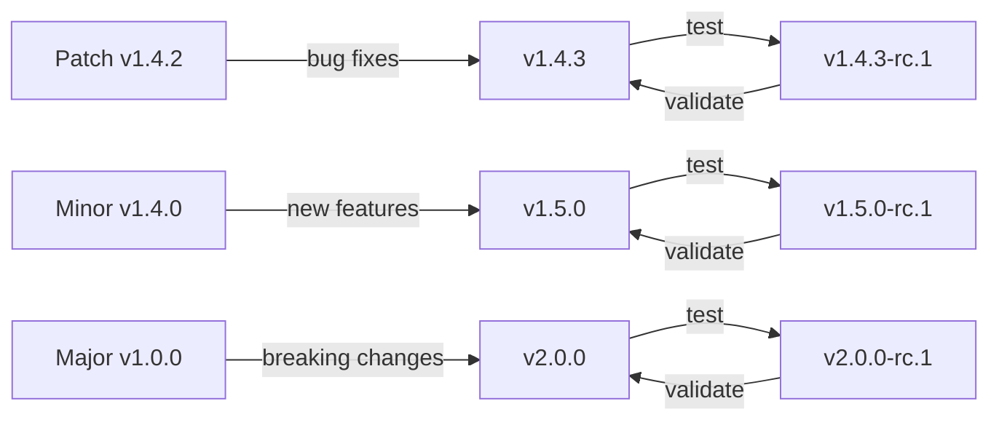

# Contributing to PyMLB StatsAPI

## Git Workflow

We follow a trunk-based development workflow with pre-release validation and dual PyPI testing.



## Complete Release Workflow

```mermaid
graph TB
    START[Developer Starts Feature] -->|create branch| BRANCH[feature/my-feature]
    BRANCH -->|write code| CODE[Implement Changes]
    CODE -->|run locally| LOCAL[Local Tests Pass]
    LOCAL -->|commit| COMMIT[Conventional Commit]
    COMMIT -->|push| PR[Create Pull Request]

    PR -->|triggers| CI[CI/CD Tests]
    CI -->|run| TESTS[Unit + BDD Tests]
    CI -->|run| LINT[Ruff + Bandit]
    CI -->|run| BUILD[Build Package]

    TESTS -->|all pass| REVIEW{Code Review}
    LINT -->|pass| REVIEW
    BUILD -->|pass| REVIEW

    REVIEW -->|approved| MERGE[Merge to main]
    MERGE -->|auto| MAIN[main branch updated]

    MAIN -->|accumulate features| READY{Ready for Release?}
    READY -->|not yet| MAIN

    READY -->|yes| PRERELEASE[Create Pre-Release Tag]
    PRERELEASE -->|tag| RCTAG[v1.5.0-rc.1]

    RCTAG -->|triggers| PRECI[Pre-Release CI/CD]
    PRECI -->|build| RCBUILD[Build RC Package]
    RCBUILD -->|test| RCTEST[Run Full Test Suite]
    RCTEST -->|publish| TESTPYPI[Publish to Test PyPI]
    TESTPYPI -->|create| GHRELEASE[GitHub Pre-Release]

    GHRELEASE -->|validate| VALIDATE{Tests Pass?}
    VALIDATE -->|fail| FIX[Fix Issues]
    FIX -->|commit| MAIN

    VALIDATE -->|pass| PROD[Create Production Tag]
    PROD -->|tag| PRODTAG[v1.5.0]

    PRODTAG -->|triggers| PRODCI[Production CI/CD]
    PRODCI -->|build| PRODBUILD[Build Release Package]
    PRODBUILD -->|test on| TESTPYPI2[Test PyPI First]
    TESTPYPI2 -->|validate| TESTPASS{Tests Pass?}

    TESTPASS -->|fail| ROLLBACK[Rollback/Fix]
    TESTPASS -->|pass| PYPI[Publish to PyPI]
    PYPI -->|create| GHPROD[GitHub Release]
    GHPROD --> DONE[Release Complete]

    style MAIN fill:#e3f2fd
    style TESTPYPI fill:#fff3e0
    style PYPI fill:#e8f5e9
    style DONE fill:#c8e6c9
    style FIX fill:#ffebee
    style ROLLBACK fill:#ffebee
```



## Detailed Workflow Steps

### 1. Feature Development



### 2. Continuous Integration (PR)

```mermaid
graph LR
    PR[Pull Request Created] -->|triggers| CI[GitHub Actions]

    CI -->|matrix| TEST1[Python 3.11 / Ubuntu]
    CI -->|matrix| TEST2[Python 3.12 / macOS]
    CI -->|matrix| TEST3[Python 3.13 / Windows]

    TEST1 -->|runs| STEPS
    TEST2 -->|runs| STEPS
    TEST3 -->|runs| STEPS

    subgraph STEPS[Test Steps]
        S1[Install Dependencies]
        S2[Ruff Check]
        S3[Ruff Format]
        S4[Bandit Security Scan]
        S5[Pytest Unit Tests]
        S6[Behave BDD Tests]
        S7[Build Package]
        S8[Twine Check]
    end

    STEPS -->|all pass| STATUS{All Jobs Pass?}
    STATUS -->|yes| READY[Ready for Review]
    STATUS -->|no| FAIL[Fix Issues]

    READY -->|approved| MERGE[Squash & Merge]

    style READY fill:#e8f5e9
    style FAIL fill:#ffebee
```



### 3. Pre-Release Process (Test PyPI)



### 4. Production Release Process



## Environment Configuration



## Branch Strategy



## Tagging Conventions

### Pre-Release Tags
- Format: `v{major}.{minor}.{patch}-rc.{number}`
- Example: `v1.5.0-rc.1`, `v1.5.0-rc.2`
- Triggers: Publish to Test PyPI, Create GitHub Pre-Release
- Purpose: Validation before production

### Production Tags
- Format: `v{major}.{minor}.{patch}`
- Example: `v1.5.0`
- Triggers: Publish to Test PyPI, then PyPI, Create GitHub Release
- Purpose: Official release

### Version Bumping



## Workflow Commands

### Start a Feature
```bash
git checkout main
git pull origin main
git checkout -b feature/my-feature

# Make changes...
uv run pytest
uv run behave
ruff check --fix .
ruff format .

git add .
git commit -m "feat: add new feature"
git push origin feature/my-feature

# Create PR on GitHub
```

### Create Pre-Release
```bash
# Ensure main is up to date
git checkout main
git pull origin main

# Create pre-release tag
git tag -a v1.5.0-rc.1 -m "Pre-release v1.5.0-rc.1

Test release for upcoming v1.5.0
- Feature A
- Feature B
- Bug fix C"

git push --tags

# Wait for CI/CD to publish to Test PyPI
# Validate on Test PyPI
pip install --index-url https://test.pypi.org/simple/ pymlb-statsapi==1.5.0rc1
```

### Create Production Release
```bash
# After pre-release validation passes
git tag -a v1.5.0 -m "Release v1.5.0

- Feature A: Description
- Feature B: Description
- Bug fix C: Description"

git push --tags

# Wait for CI/CD to:
# 1. Publish to Test PyPI
# 2. Validate
# 3. Require approval
# 4. Publish to PyPI
# 5. Create GitHub Release
```

### Hotfix Flow
```bash
# If production issue found
git checkout -b hotfix/critical-bug

# Fix the issue
git commit -m "fix: critical bug description"
git push origin hotfix/critical-bug

# Create PR, merge to main
# Then create new release:
git tag -a v1.5.1-rc.1 -m "Hotfix pre-release"
git push --tags

# Validate on Test PyPI
# Then:
git tag -a v1.5.1 -m "Hotfix release"
git push --tags
```

## CI/CD Workflow Files

### Tests Workflow (`.github/workflows/ci-cd.yml`)
```yaml
on:
  push:
    branches: [main]
  pull_request:
    branches: [main]

jobs:
  test:
    strategy:
      matrix:
        python-version: [3.11, 3.12, 3.13]
        os: [ubuntu-latest, macos-latest, windows-latest]
```

### Publish Workflow (`.github/workflows/publish.yml`)
```yaml
on:
  push:
    tags:
      - 'v*.*.*'        # Production: v1.5.0
      - 'v*.*.*-rc.*'   # Pre-release: v1.5.0-rc.1

jobs:
  publish:
    environment:
      name: ${{ contains(github.ref, '-rc') && 'testpypi' || 'pypi' }}
```

## Protection Rules

### Main Branch
- ✅ Require pull request reviews (1 reviewer)
- ✅ Require status checks to pass
  - Tests (Python 3.11, 3.12, 3.13)
  - Ruff
  - Bandit
  - Build
- ✅ Require conversation resolution
- ✅ Require linear history (squash merges)

### PyPI Environment
- ✅ Required reviewers (repository admins)
- ✅ Wait timer: 5 minutes (safety delay)
- ✅ Deployment branches: tags only (`v*`)

### Test PyPI Environment
- ⚠️ No approval required (automated testing)
- ✅ Deployment branches: tags only (`v*`)

## Release Checklist

### Pre-Release (Test PyPI)
- [ ] All features merged to main
- [ ] All tests passing (97%+ coverage)
- [ ] Version bumped appropriately
- [ ] CHANGELOG updated
- [ ] Create RC tag (`v1.5.0-rc.1`)
- [ ] Wait for Test PyPI publish
- [ ] Install from Test PyPI
- [ ] Run integration tests
- [ ] Validate functionality

### Production Release
- [ ] Pre-release validation passed
- [ ] Create production tag (`v1.5.0`)
- [ ] Wait for Test PyPI publish
- [ ] Approve PyPI deployment
- [ ] Wait for PyPI publish
- [ ] Verify on PyPI
- [ ] Test installation: `pip install pymlb-statsapi==1.5.0`
- [ ] GitHub Release created automatically
- [ ] Update documentation if needed
- [ ] Announce release

## Troubleshooting

### Tag Not Triggering Workflow
```bash
# Check if tag exists remotely
git ls-remote --tags origin | grep v1.5.0

# Re-push tag if needed
git push origin v1.5.0

# Or manually trigger workflow
gh workflow run publish.yml --ref v1.5.0 --field environment=pypi
```

### Pre-Release Validation Fails
```bash
# Delete bad RC tag
git tag -d v1.5.0-rc.1
git push origin :refs/tags/v1.5.0-rc.1

# Fix issues
git commit -m "fix: issue from pre-release testing"
git push origin main

# Create new RC
git tag -a v1.5.0-rc.2 -m "Pre-release v1.5.0-rc.2 (fixed)"
git push --tags
```

### Production Release Issues
```bash
# If published to PyPI but has issues
# CANNOT delete from PyPI, must bump version

git tag -a v1.5.1-rc.1 -m "Hotfix for v1.5.0 issues"
git push --tags

# After validation:
git tag -a v1.5.1 -m "Hotfix release"
git push --tags
```

## Best Practices

1. **Always use conventional commits**
   - `feat:` for new features
   - `fix:` for bug fixes
   - `test:` for test improvements
   - `docs:` for documentation
   - `chore:` for maintenance

2. **Keep main stable**
   - All tests must pass before merge
   - Use squash merges for clean history
   - Never commit directly to main

3. **Test on Test PyPI first**
   - Always create RC tags before production
   - Validate thoroughly on Test PyPI
   - Don't skip pre-release testing

4. **Use semantic versioning**
   - Patch: Bug fixes, no API changes
   - Minor: New features, backward compatible
   - Major: Breaking changes

5. **Document everything**
   - Update CHANGELOG for each release
   - Write clear commit messages
   - Add docstrings for new code

6. **Monitor releases**
   - Watch CI/CD workflows
   - Verify PyPI publication
   - Test installation after release
